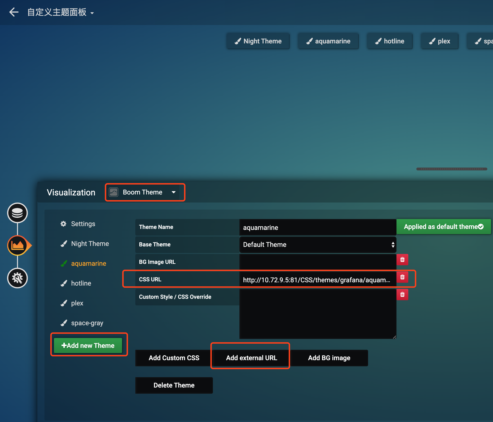

## 1、安装插件 Boom Theme Panel
- https://grafana.com/grafana/plugins/yesoreyeram-boomtheme-panel
    ```
    grafana-cli plugins install yesoreyeram-boomtheme-panel
    ```
## 2、配置Dashboard
- 1、新建Dashboard,Visualization 选择Boom Theme

- 2、新建自定义主题
  - 自定义主题: https://github.com/gilbN/theme.park
  - 由于theme.park可能受网络限制,可以clone下来后运行一个nginx代理下(文件引用需要手动处理)
    - 下载theme.park-master.zip
    - 解压后将CSS,Resources目录存放至nginx/html目录下做静态代理
    - 修改themes/grafana/相关文件引用
      - 同目录引用修改为 ./xxx.css,如aquamarine.css引用grafana-base.css
         - 原引用: @import url(https://gilbn.github.io/theme.park/CSS/themes/grafana/grafana-base.css);
         - 修改后: @import url(./grafana-base.css);
      - 非同目录引用修改为相对路径引用,如plex.css引用 blur-noise.png,
         - 原引用:  --main-bg-color: url("https://raw.githubusercontent.com/gilbN/theme.park/master/Resources/blur-noise.png"),
         - 修改后: --main-bg-color: url("../../../Resources/blur-noise.png")
  - docker构建并运行
  ```
  docker build -t grafana-theme-server
  docker run -d -p 80:80 grafana-theme-server
  ```
  - 启动nginx代理后访问http://${NGINX_HOST}/CSS/themes/grafana/aquamarine.css测试是否正常
  - 在grafana新增的theme中 CSS URL填入自定义样式地址。
  - 保存后创建相关图表与原来方式一致。
  - 复制该面板即可使用相同的主题。
## 3、参考链接
- https://mp.weixin.qq.com/s/6nzi8cGSYhibfDtkhw5Z6g
